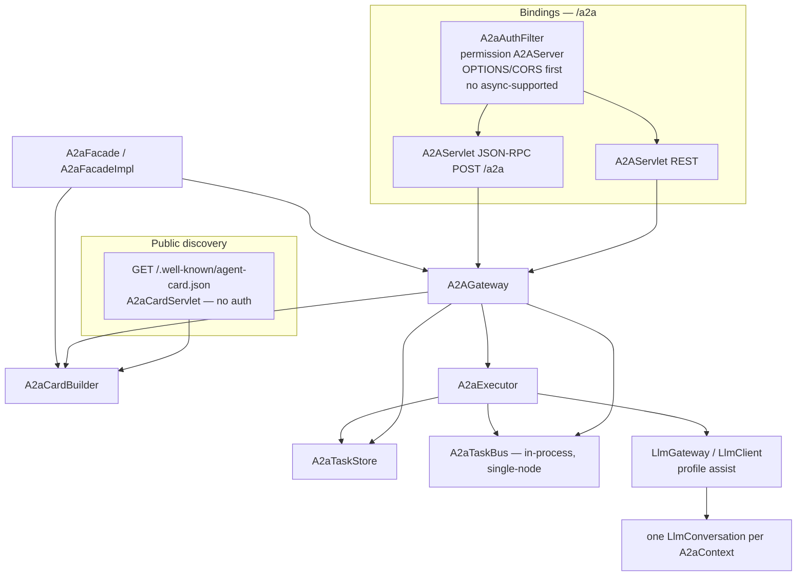
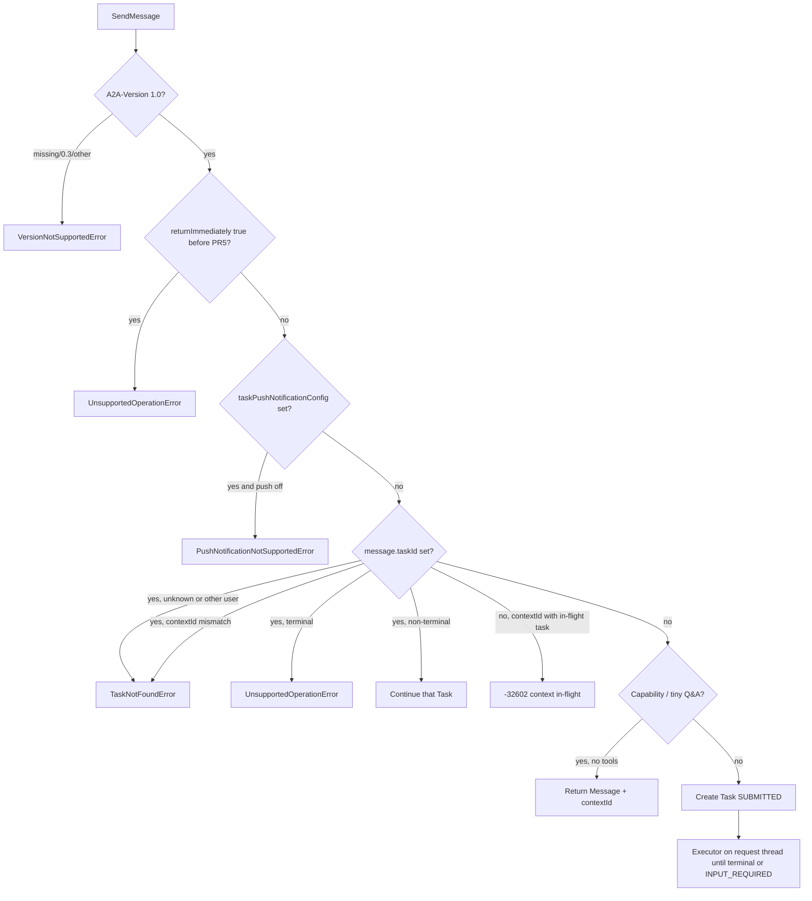
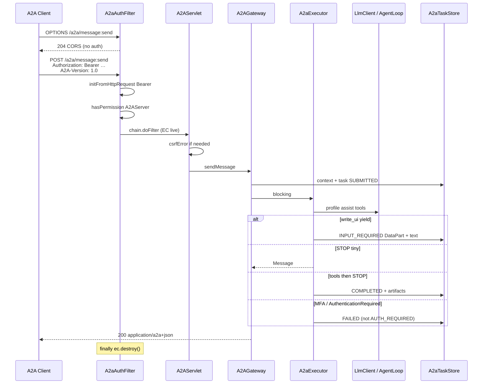
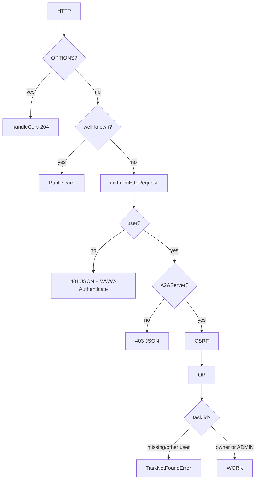

# Moqui A2A Server (remote agent)

- **Author:** Moqui contributors
- **Date:** 2026-09-04
- **Status:** Draft
- **Normative protocol:** [A2A 1.0.0](https://a2a-protocol.org/latest/specification/) (`supportedInterfaces[].protocolVersion: "1.0"`)

This is an implementation plan only. Do not treat any class below as already present.

## Overview

Community feedback on the `llm-client` branch asked for an A2A Server so other agents can discover and invoke Moqui as a remote agent. Moqui already has an opaque agent: `LlmClient` / `LlmAgentLoop` behind `LlmServlet` at `/llm/*`. That surface is Assist-shaped (conversations, SSE on the request thread, `write_ui` yield). A2A is a different protocol with its own Task lifecycle, Agent Card, REST + JSON-RPC bindings, and enterprise auth.

v1 implements a **native A2A 1.0 Server** (HTTP+JSON/REST preferred, JSON-RPC 2.0 as the common client binding, **no gRPC**) that sits in front of the existing LLM stack. Incoming A2A Parts become Llm user text/files; agent output becomes A2A Message/Artifact Parts; `write_ui` yield becomes `TASK_STATE_INPUT_REQUIRED`. Discovery is `GET /.well-known/agent-card.json` (served in the same PR that maps `/a2a`). Operations live in a binding-agnostic `A2AGateway`. Persistence is new `moqui.a2a.*` entities — not a reuse of `LlmConversation.statusId`.

A full A2A Client (Moqui calling other agents) is out of scope for v1.

## Background & Motivation

### Why this change is needed

A2A is the inter-agent contract. Without a Server, Moqui is only callable as Assist (`/llm/v1/chat`) or Service REST (`/rest/s1/moqui/llm/...`). Those APIs are Moqui-specific, have no Agent Card, and do not speak Task/Part/Artifact. Remote agents cannot discover skills, stream A2A events, or resume an `INPUT_REQUIRED` form with a standard client.

### Current Moqui surface (verified on `llm-client`)

| Piece | Where | Constraint this plan inherits |
| --- | --- | --- |
| Sequential tool loop | `framework/src/main/groovy/org/moqui/impl/llm/LlmAgentLoop.java` | Server tools first; remaining CLIENT tools yield (`write_ui`) |
| Tools | `RequestTool`, `RunServiceTool`, `BrowseTool`, `WriteUiTool` (schemaVersion **3**, server never submits), `FindSkillTool`, `EnterSimTool` | Artifact authz stays on |
| Conversations | `moqui.llm.LlmConversation` / `LlmMessage` / `LlmCallLog` in `framework/entity/LlmEntities.xml` | Status enum is Assist (`LlmcsActive`/`Streaming`/`Yielded`/…), **not** A2A Task states. `beginTurnStreaming` 409s if `LlmcsStreaming`, or `LlmcsYielded` without resume |
| Skills | `component://*/skill/*.md` + `LlmSkill`; `SkillIndex` | Front matter: `name`, `description`, `risk`, `services`, `screens` (no `tags`) |
| Servlet | `LlmServlet` `/llm/*` + `MoquiAuthFilter` (`filter name="LlmAuthFilter"` in conf, **class** `MoquiAuthFilter`) permission `LlmGateway` | **No `startAsync`**. Comment on `LlmServlet`: “No startAsync — the filter destroys the EC in finally after chain.doFilter”. A2A servlet **must** copy this |
| CSRF | `LlmGateway.csrfError` | Skip when `moqui.request.authenticated` (login_key/Basic after **successful** login). Dummy header presence does not skip |
| Service REST | `runtime/base-component/tools/service/moqui.rest.xml` resource `llm`; `LlmServices.xml` | Sync only, no SSE |
| AT_LLM | `ArtifactExecutionInfo.AT_LLM`; seed in `framework/data/LlmTypeData.xml` | `inheritAuthz=N`; tarpit 30 hits / 60s / 300s block; ADMIN default |
| Profiles | `<llm-facade>` in `MoquiDefaultConf.xml` | Framework `default` does **not** set `allow-write-ui` (XSD default false). Assist profile is `assist` in `runtime/base-component/tools/MoquiConf.xml` (`allow-write-ui`, `allow-browse`, `allow-run-service`, `allow-unprefixed-request`) |
| JSON-RPC for **services** | `ServiceJsonRpcDispatcher` via screen `/rpc/json` | **Do not overload** with A2A methods. Method names are Moqui services; batches exist |
| REST API | `RestApi.groovy` + `/rest` | A2A REST is a dedicated servlet (SSE, JSON-RPC, well-known, colon-verb URLs) |
| `robots.txt` | `webroot.xml` transition | Disallows `apps,vapps,qapps,rest,rpc,status,menuData,llm` |
| persistIsolated | `LlmConversationImpl.persistIsolated` | Same-thread suspend/begin/commit/resume; `disableAuthz` only for LLM/A2A **own** rows |
| Worker threads | `ecfi.workerPool`; `ServiceCallAsyncImpl` | Async service **disables authz** (`runInternal` ~173). `ThreadPoolRunnable(ecfi, closure)` does **not** login a user; the closure must `getEci()` + `internalLoginUser` |
| SSO | `runtime/component/moqui-sso/` | pac4j **browser** OIDC/OAuth/SAML. `AuthFlow.inbound` exists; `AuthenticationClientFactory.buildAll()` **skips** `inbound=Y`. nimbus-jose-jwt is SSO classpath only |
| Authc | `UserFacadeImpl.initFromHttpRequest` | Session, `Authorization: Basic`, headers `api_key`/`login_key`. **Does not parse `Authorization: Bearer`**. `loginUserKey` writes `messageFacade` errors on miss |
| Sealed perms | `user_sealed_permissions` in `MoquiDefaultConf.xml` | GROOVY_SHELL_WEB, SQL_RUNNER_WEB, … KibanaRemote, REST_SCHEMA. **Not** `LlmGateway` |

Verified: `Authorization` handling in `UserFacadeImpl.groovy` (lines 148–176) only strips `"Basic "`. A2A clients typically send Bearer. This is a required **global** authc extension.

## Goals & Non-Goals

### Goals (v1)

- A2A 1.0 Server: discovery + Send/Get/List/Cancel, then Stream/Subscribe, then extended card.
- Bindings: **HTTP+JSON/REST** (preferred) and **JSON-RPC 2.0**, one operations layer. JSON-RPC method names are spec **5.3 / 9.1 PascalCase** (`SendMessage`). Ignore spec 9.3’s leftover `"method": "category/action"` example; never map to Moqui `foo.bar#Baz`.
- Hybrid response: `Message` for capability negotiation / tiny Q&A; `Task` once work is committed.
- Opaque executor = existing `LlmGateway` / `LlmClient` on the **Assist** LLM profile (write_ui/browse/run_service).
- Authc: existing api_key / Basic / session, **plus Bearer** (UserLoginKey, then OIDC JWT if moqui-sso present).
- Authz: `A2AServer` permission is the real gate; task Get/List/Cancel/Send-with-taskId scoped to owner (and ADMIN); **404 not 403** on another user’s task.
- Request-thread SSE, no `startAsync`, same ping-timer pattern as `LlmServlet.SseSink`.
- Public Agent Card with one generic skill (`moqui-assist`); authenticated extended card with authorized SkillIndex skills.

### Non-goals (v1)

- A2A **Client**.
- gRPC.
- Official `a2a-java` / Quarkus/CDI reference server.
- Multi-agent-per-profile catalog.
- Push notifications **on** (`capabilities.pushNotifications: false` until PR5); entities + SSRF rules exist from PR1.
- `returnImmediately: true` until PR5 (until then: `UnsupportedOperationError`).
- `TASK_STATE_AUTH_REQUIRED` on the wire (clients cannot complete Moqui MFA). Map secondary-auth exceptions to `FAILED`.
- Fetching inbound Part `url`s that are not already Moqui content URLs.
- Cluster-wide SSE/subscribe/push (single-node in v1).
- A2A TCK pass.
- New core A2A enum values or core fields (extras in `metadata`).
- Moqui as an OAuth **authorization server**.
- Agent Card JWS signing.
- JSON-RPC **batch** (reject `-32600`; do not execute the first element).
- Spec `GET /agents` / marketplace (`GET /a2a/agents` is **not** in v1).

## Key Decisions

1. **Native implementation, not `a2a-java`.** `LlmServlet` already has EC, Shiro, artifact authz, request-thread SSE. A Quarkus/CDI SDK would fight `MoquiAuthFilter`’s `finally { ec.destroy() }`.

2. **Dedicated `A2AServlet` + `A2aCardServlet`, not Service REST and not `/rpc/json`.** Colon-verb paths, SSE, JSON-RPC method namespace, and well-known do not fit `RestApi.groovy` or `ServiceJsonRpcDispatcher`.

3. **REST + JSON-RPC share `A2AGateway`.** `supportedInterfaces[0].protocolBinding = "HTTP+JSON"`. JSON-RPC is the common client binding.

4. **Separate `moqui.a2a` store.** A2A Task states are not `Llmcs*`. `A2aContext` has optional `conversationId` FK.

5. **Cardinality (A).** One `LlmConversation` per `A2aContext`. **At most one non-terminal `A2aTask` per context.** Refinements after a terminal task reuse the same conversation (new A2A task, `beginTurnStreaming` on Complete is allowed). A new SendMessage with `contextId` and no `taskId` while a task is WORKING/INPUT_REQUIRED is `-32602` / 400 (“context has an in-flight task; send message.taskId to continue or wait until terminal”). Parallel follow-ups are out of v1.

6. **Hybrid Message/Task.** Tiny Q&A and capability negotiation return a `Message` (still allocate `contextId`). Tools, `write_ui`, artifacts, or an existing `taskId` → `Task`. Terminal tasks are immutable; refinements are new tasks with the same `contextId` + `referenceTaskIds`.

7. **Distinct `A2AServer` permission.** ADMIN is seeded both `A2AServer` and `LlmGateway`. Not sealed (same as `LlmGateway`): assignable via Tools screens. Filter permission is the **real** gate. ArtifactAuthz on `AT_REST_PATH` `a2a/.*` is `ALL_USERS` **`AUTHZT_ALLOW` + `AUTHZA_VIEW`** with member `inheritAuthz=N` (there is no `AUTHZT_VIEW`; AuthzType is ALLOW/DENY/ALWAYS, AuthzAction is VIEW/CREATE/…). Gateway `push` uses `AUTHZA_VIEW` even on POST so CREATE is not required. Tarpit is **AT_LLM only**.

8. **Bearer: silent UserLoginKey first, then OIDC JWT via SPI.** Framework must not depend on nimbus-jose-jwt. Dummy `Authorization: Bearer` without a successful login **must not** set `moqui.request.authenticated`.

9. **Public card: one generic skill `id=moqui-assist`.** Spec 5.7: required arrays MUST be non-empty. `public-skills=none` means “generic skill only”, not `skills: []`. Extended card lists SkillIndex skills the caller may see. No top-level `protocolVersion` (only on `AgentInterface`). Security objects are 1.0 ProtoJSON oneofs (not OpenAPI `{ "api_key": [] }`).

10. **LLM profile is `assist`, not `default`.** Framework `default` does not attach `write_ui`/`request`/`browse`/`run_service`. `a2a-facade.@default-profile` defaults to `assist` (tools component). Missing profile → SendMessage fails loud, never silently degrades to chat-only `default`.

11. **`returnImmediately` default false; until PR5, `true` is `-32004`.** Async worker needs a **new** ECI + `internalLoginUser` + authz on. Never `ServiceCallAsync`. Until PR5, `configuration.taskPushNotificationConfig` present → `-32003` (do not persist a webhook).

12. **Push off until PR5, model entities now.** Card `pushNotifications: false`. Push CRUD ops always `-32003` until the flag is true **and** the sender exists.

13. **JSON wire is A2A 1.0 ProtoJSON.** camelCase fields. Enums `TASK_STATE_*`, `ROLE_USER`. REST GetTask/Cancel return a raw `Task` (`id` on the wire = entity `taskId`). SendMessage REST returns `{task|message}`. ListTasks envelope always includes `nextPageToken` (`""` on last page). `includeArtifacts` default false **omits** `artifacts` (not `[]`).

14. **JSON-RPC application errors are HTTP 200** with a JSON-RPC 2.0 `error` object (spec 9.5). HTTP 401/403/429 stay at the filter. REST uses spec 5.4 HTTP statuses + google.rpc.Status body (11.6).

15. **Get/List/Cancel/Send-with-taskId: owner or ADMIN; else `TaskNotFoundError`.** Unknown, other-user, and mismatched `contextId`+`taskId` are all `-32001`. Infer `contextId` from `taskId` when omitted (spec 3.4.3).

16. **`messageId` idempotency is per owner.** Unique `(userId, messageId)`. Duplicate for this user returns the original result. Never look up globally; never return another user’s payload.

17. **Inbound Part `url`: do not fetch in v1** unless it is already a Moqui `dbresource://` (or an existing, readable `content://`) location this user can read. Files we persist are **`dbresource://A2a/{contextId}/...`**, not `content://` (that is JCR). Otherwise `-32602` and ask for `raw` under `inline-part-max-bytes`.

18. **Never emit `TASK_STATE_AUTH_REQUIRED` in v1.** MFA/login exceptions → `FAILED` with a status message. No AUTH_REQUIRED resume protocol.

19. **Strict `A2A-Version`.** Header or query param `A2A-Version` (spec 3.6.1). Missing, empty, or `0.3` → `VersionNotSupportedError` `-32009`. Only `1.0` / `1.0.0` accepted. This **rejects 0.3 clients that omit the header** (intentional for a 1.0-only server).

20. **Single-node for SSE / subscribe / in-process bus / PR5 async.** `A2aTaskBus` is per-JVM. Cluster operators use GetTask polling until a later topic. PR5 must not claim cross-node subscribe.

21. **Well-known ships with `/a2a`, not before.** Capability flags on the card match implemented happy paths. Stream/push/extended **routes** exist as capability-gated errors as soon as the servlet exists.

22. **Cursor ListTasks** as spec 3.1.4: opaque `pageToken`, sort `statusDate` desc then `taskId` desc, owner-scoped query reapplied on every page. `pageSize` default 50, min 1, max 100. **`historyLength` clamp is shared:** unset → default **20**, cap **50**, `0` omits `history`. Applies to GetTask, ListTasks, **SendMessage / Cancel Task payloads**, and the **first SSE `Task` event** (`SendMessageConfiguration.historyLength`, spec 3.2.2).

23. **A2A source lives under the existing LLM packages.** Public API in `org.moqui.llm.a2a` (`framework/src/main/java/org/moqui/llm/a2a/`). Implementation — gateway, store, executor, JSON-RPC, **and** the HTTP servlet/filter — in `org.moqui.impl.llm.a2a` (`framework/src/main/groovy/org/moqui/impl/llm/a2a/`). `ExecutionContext.getA2a()` returns `org.moqui.llm.a2a.A2aFacade` (unlike `LlmFacade`, which stays in `org.moqui.context`). `BearerTokenAuthenticator` stays in `org.moqui.context` because it is a global `UserFacade` SPI, not A2A-only. Subpackage `org.moqui.impl.llm.a2a` still cannot see package-private members of `org.moqui.impl.llm` (`LlmJson`, `getProfileState`); keep using public `LlmGateway` / `LlmFacade` APIs.

## Proposed Design

### Architecture



Package layout (A2A nests under the existing LLM trees; do **not** add `org.moqui.impl.a2a` or put A2A servlets in `org.moqui.impl.webapp`):

| Class | Path |
| --- | --- |
| `A2aFacade` | `framework/src/main/java/org/moqui/llm/a2a/A2aFacade.java` |
| `A2aFacadeImpl` | `framework/src/main/groovy/org/moqui/impl/llm/a2a/A2aFacadeImpl.java` |
| `A2AServlet` | `framework/src/main/groovy/org/moqui/impl/llm/a2a/A2AServlet.groovy` |
| `A2aCardServlet` | `framework/src/main/groovy/org/moqui/impl/llm/a2a/A2aCardServlet.groovy` |
| `A2aAuthFilter` | `framework/src/main/groovy/org/moqui/impl/llm/a2a/A2aAuthFilter.groovy` |
| `A2AGateway` | `framework/src/main/groovy/org/moqui/impl/llm/a2a/A2AGateway.java` |
| `A2aJsonRpc` | `framework/src/main/groovy/org/moqui/impl/llm/a2a/A2aJsonRpc.java` |
| `A2aTaskStore` | `framework/src/main/groovy/org/moqui/impl/llm/a2a/A2aTaskStore.java` (`toWireTask` historyLength clamp) |
| `A2aExecutor` | `framework/src/main/groovy/org/moqui/impl/llm/a2a/A2aExecutor.java` |
| `A2aCardBuilder` | `framework/src/main/groovy/org/moqui/impl/llm/a2a/A2aCardBuilder.java` |
| `A2aTaskBus` | `framework/src/main/groovy/org/moqui/impl/llm/a2a/A2aTaskBus.java` |
| `A2aTypes` | `framework/src/main/groovy/org/moqui/impl/llm/a2a/A2aTypes.java` |
| `A2aJson` | `framework/src/main/groovy/org/moqui/impl/llm/a2a/A2aJson.java` — thin wrapper around the same Jackson setup as `LlmJson` (do not widen `LlmJson` package-private; subpackage cannot see it) |
| `BearerTokenAuthenticator` | `framework/src/main/java/org/moqui/context/BearerTokenAuthenticator.java` |
| SSO JWT | `runtime/component/moqui-sso/.../OidcBearerAuthenticator.groovy` + ToolFactory that **is** a tool named `a2a-oidc-bearer` |
| Entities | `framework/entity/A2aEntities.xml` |
| Seed | `framework/data/A2aTypeData.xml` |
| Services | `framework/service/org/moqui/impl/A2aServices.xml` (`clean#A2aData`) |

Do **not** add A2A methods to `LlmServices.xml` or `moqui.rest.xml`.

### Facade / SPI wiring

`A2aFacade` in `org.moqui.llm.a2a` (same role as `LlmFacade`, different package):

```java
public interface A2aFacade {
    boolean isEnabled();
    String getDefaultProfileName();
    int getWorkerLimit();
    int getHistoryLengthDefault(); // 20
    int getHistoryLengthCap();     // 50
    int getInlinePartMaxBytes();
    Map<String, Object> publicAgentCard(ExecutionContext ec);
    Map<String, Object> extendedAgentCard(ExecutionContext ec);
}
```

`ExecutionContext.getA2a()` and `ExecutionContextFactory.getA2a()` like `getLlm()`.

`ExecutionContextFactoryImpl`:

- Field `public final A2aFacadeImpl a2aFacade` constructed next to `llmFacade` (~246 / ~308).
- Field `BearerTokenAuthenticator bearerTokenAuthenticator` (nullable). After tool factories init: if `getToolFactory("a2a-oidc-bearer") != null`, set the field from that tool instance. `UserFacadeImpl` reads `ecfi.bearerTokenAuthenticator`.
- Conf merge next to llm-facade (~1712): `mergeChildWithChildKey(..., "a2a-facade", ...)` for `provider` and later `extension` children.
- XSD: `<xs:element minOccurs="0" ref="a2a-facade"/>` in `moqui-conf` sequence **immediately after** `llm-facade` (`framework/xsd/moqui-conf-3.xsd` ~34).
- Destroy `a2aFacade` in `destroy()` next to `llmFacade`.

`A2aFacadeImpl.init`: if `default-profile` is set and **`!ecfi.getLlm().getProfileNames().contains(name)`** (public `LlmFacade.getProfileNames()`; do **not** call package-private `LlmFacadeImpl.getProfileState` from `org.moqui.impl.llm.a2a`), log error “A2A default-profile X missing (need tools component assist profile or a runtime snippet)”. SendMessage then returns JSON-RPC `-32603` / REST 500 with that message — **not** a silent fallback to `default`.

Worker sketch (PR5 only; ECFI constructor, **never** the ECI constructor which copies `authzDisabled`):

```groovy
String username = eci.user.username
String taskId = task.taskId
ecfi.workerPool.execute(new ExecutionContextImpl.ThreadPoolRunnable(ecfi, {
    ExecutionContextImpl threadEci = ecfi.getEci()
    threadEci.userFacade.internalLoginUser(username, false)
    // authz remains ON (do not disableAuthz)
    org.moqui.impl.llm.a2a.A2aExecutor.runExisting(threadEci, taskId)
    // ThreadPoolRunnable.finally calls destroyActiveExecutionContext()
}))
```

Do not pass the request ECI. Do not use `ServiceCallAsync`.

### Servlet mapping

`MoquiContextListener` registers `<servlet>` / `<filter>` from conf. Pattern specificity beats `MoquiServlet` `/*`.

```
<!-- Public card. No auth filter. No async-supported. Same PR as /a2a (PR2). -->
<servlet name="A2aCardServlet" class="org.moqui.impl.llm.a2a.A2aCardServlet" load-on-startup="1">
    <url-pattern>/.well-known/agent-card.json</url-pattern>
</servlet>

<!-- New filter modeled on MoquiAuthFilter as used by /llm/* (conf name LlmAuthFilter,
     class org.moqui.impl.webapp.MoquiAuthFilter). Class lives in org.moqui.impl.llm.a2a, not webapp. -->
<filter name="A2aAuthFilter" class="org.moqui.impl.llm.a2a.A2aAuthFilter">
    <init-param name="permission" value="A2AServer"/>
    <url-pattern>/a2a/*</url-pattern>
    <url-pattern>/a2a</url-pattern>
</filter>
<servlet name="A2AServlet" class="org.moqui.impl.llm.a2a.A2AServlet" load-on-startup="1">
    <url-pattern>/a2a/*</url-pattern>
    <url-pattern>/a2a</url-pattern>
</servlet>
```

`/a2a/*` does **not** match `POST /a2a`. Register both.

`A2aCardServlet`: `ecfi.getEci()`, serve card, `ec.destroy()` in `finally`. Call `MoquiServlet.handleCors` first.

`A2AServlet`: reuse `ecfi.activeContext.get()` from the filter; **must not** destroy it.

`A2aAuthFilter` differences from `MoquiAuthFilter`:

1. **OPTIONS first:** `MoquiServlet.handleCors`; if preflight, 204 and return **before** auth. Preflight has no `Authorization`.
2. Then create ECI, `initFromHttpRequest`, permission check (same as `MoquiAuthFilter`).
3. **401/403/429 bodies** are REST google.rpc.Status JSON (`Content-Type: application/a2a+json`), **not** `response.sendError` HTML. JSON-RPC clients still get HTTP 401 at the transport layer (spec 7) — that is correct; they never reach the JSON-RPC envelope.
4. 401 includes:
   ```
   WWW-Authenticate: Bearer realm="Moqui A2A"
   WWW-Authenticate: Basic realm="Moqui A2A"
   WWW-Authenticate: ApiKey header="api_key"
   ```
5. No `async-supported`.

### Bindings and routes

`A2AGateway.parseRoute(pathInfo, method)`:

| Op | REST (relative to `/a2a`) | JSON-RPC method (spec 5.3) | REST success body |
| --- | --- | --- | --- |
| Send message | `POST /message:send` | `SendMessage` | `SendMessageResponse` `{task}` **or** `{message}` |
| Stream | `POST /message:stream` | `SendStreamingMessage` | SSE `StreamResponse` events |
| Get task | `GET /tasks/{id}` | `GetTask` | raw **`Task`** (not wrapped) |
| List tasks | `GET /tasks` | `ListTasks` | `{tasks, nextPageToken, pageSize, totalSize}` |
| Cancel | `POST /tasks/{id}:cancel` | `CancelTask` | raw **`Task`** |
| Subscribe | `POST /tasks/{id}:subscribe` | `SubscribeToTask` | SSE |
| Create push config | `POST /tasks/{id}/pushNotificationConfigs` | `CreateTaskPushNotificationConfig` | config (or `-32003` until PR5) |
| Get push config | `GET /tasks/{id}/pushNotificationConfigs/{configId}` | `GetTaskPushNotificationConfig` | config or `-32003` |
| List push configs | `GET /tasks/{id}/pushNotificationConfigs` | `ListTaskPushNotificationConfigs` | list or `-32003` |
| Delete push config | `DELETE /tasks/{id}/pushNotificationConfigs/{configId}` | `DeleteTaskPushNotificationConfig` | empty / `-32003` |
| Extended card | `GET /extendedAgentCard` | `GetExtendedAgentCard` | raw **`AgentCard`** (or `-32004` until PR4) |

No `GET /agents` in v1: that path is 404 (unknown REST route) / JSON-RPC `-32601`. Do not put it on the card.

JSON-RPC: `POST /a2a` (and `POST /a2a/` if pathInfo empty). Body `{jsonrpc:"2.0", method, params, id}`. Detect REST vs RPC **by path**, not Content-Type.

If the JSON-RPC body is a **JSON array** (batch): HTTP **200**, `{"jsonrpc":"2.0","id":null,"error":{"code":-32600,"message":"Batch not supported"}}`. Do not dispatch the first element.

### Headers / `A2A-Version`

- `A2A-Version` (header **or** query parameter `A2A-Version`, spec 3.6.1). Accepted: `1.0`, `1.0.0`. **Missing, empty, `0.3`, any other major/minor → `VersionNotSupportedError` `-32009`.** REST HTTP 400; JSON-RPC HTTP 200 + error `-32009`. This rejects 0.3 clients that omit the header; that is intentional for a 1.0-only server.
- `A2A-Extensions`: comma-separated URIs; echo activated URIs on the response.
- CORS: append `A2A-Version,A2A-Extensions` to allow-headers (`MoquiDefaultConf.xml` ~315). Expose those plus `ETag`.

Content-Type:

- REST: request/response `application/a2a+json`; also accept `application/json`.
- REST errors: `application/a2a+json` google.rpc.Status (11.6).
- JSON-RPC: `application/json`; app errors still HTTP 200.
- Streams: `text/event-stream; charset=UTF-8`, `Cache-Control: no-cache, no-store`, `X-Accel-Buffering: no`. REST `data:` = `StreamResponse`. JSON-RPC `data:` = `{jsonrpc,id,result: StreamResponse}`. Pings are SSE **comments** (`: ping\n\n`) so REST `data:` stays a StreamResponse.

JSON field names: camelCase. Enums: `TASK_STATE_WORKING`, `ROLE_USER`. Timestamps: `YYYY-MM-DDTHH:mm:ss.sssZ`.

Wire `Task.id` = entity `taskId`. Never emit `taskId` as the Task’s primary field.

### Request validation

Reject with REST 400 / JSON-RPC `-32602` (unless noted):

| Rule | Error |
| --- | --- |
| `Message.messageId` missing/blank | invalid params |
| `Message.parts` missing or empty (spec 5.7) | invalid params (`google.rpc.BadRequest` on `message.parts`) |
| Part with zero or >1 of `text`/`raw`/`url`/`data` | invalid params |
| `raw` longer than `inline-part-max-bytes` (65536) | invalid params |
| Part `url` not a readable `dbresource://` (or existing readable `content://`) | invalid params (do **not** fetch) |
| `tenant` present and non-empty (we do not declare tenant on AgentInterface) | invalid params |
| JSON-RPC batch (array) | `-32600`, HTTP 200 |
| JSON-RPC unknown method | `-32601`, HTTP 200 |
| `configuration.acceptedOutputModes` non-empty and **disjoint** from `{text/plain, application/json}` | `ContentTypeNotSupportedError` `-32005`. A mix that includes at least one supported type is OK; extra types are ignored |
| `returnImmediately: true` before PR5 | `UnsupportedOperationError` `-32004` |
| `taskPushNotificationConfig` present while `pushNotifications` false | `PushNotificationNotSupportedError` `-32003` |
| Stream/subscribe while `capabilities.streaming` false | `-32004` (not 404) |
| GetExtended while `extendedAgentCard` false | `-32004`. If flag true but builder missing: `-32007` |
| Push CRUD while `pushNotifications` false | `-32003` (not unknown path) |
| `A2A-Version` missing/empty/not 1.0 | `-32009` |
| `pageSize` not in 1..100 | invalid params |
| `historyLength` negative | invalid params; values above cap **clamped** to 50. Unset (Get/List query, SendMessage `configuration.historyLength`, Cancel) → default 20. `0` omits `history` on the Task |

**Skill invocation:** `AgentSkill` is descriptive. There is **no** RPC to “run skill X”. v1 is natural language + `find_skill` / existing `forceSkillUse` conversation attribute. Honor `message.metadata.forceSkillUse` and `message.metadata.activeSkillName` the same way `LlmGateway.applyForceSkillUse` reads the chat body. Do not invent `message.metadata.skillId` as a dispatcher.

### Protocol types (`A2aTypes`)

Hand-written constants + Map builders. No protobuf dependency.

| Wire | Entity `statusId` | Kind | v1 emit? |
| --- | --- | --- | --- |
| `TASK_STATE_SUBMITTED` | `A2atsSubmitted` | in-progress | yes |
| `TASK_STATE_WORKING` | `A2atsWorking` | in-progress | yes |
| `TASK_STATE_COMPLETED` | `A2atsCompleted` | terminal | yes |
| `TASK_STATE_FAILED` | `A2atsFailed` | terminal | yes |
| `TASK_STATE_CANCELED` | `A2atsCanceled` | terminal | yes |
| `TASK_STATE_REJECTED` | `A2atsRejected` | terminal | yes |
| `TASK_STATE_INPUT_REQUIRED` | `A2atsInputRequired` | interrupted | yes |
| `TASK_STATE_AUTH_REQUIRED` | `A2atsAuthRequired` | interrupted | **never in v1** (seed enum only) |

Terminal ⇒ immutable. `message.taskId` pointing at a terminal task → `UnsupportedOperationError` `-32004`. Refinement: new task, same `contextId`, `referenceTaskIds`.

Cancelable in v1: `SUBMITTED`, `WORKING`, `INPUT_REQUIRED`.

Roles: `ROLE_USER`, `ROLE_AGENT`.

`StreamResponse` oneof: `task` | `message` | `statusUpdate` | `artifactUpdate`.

`SendMessageResponse` oneof: `task` | `message`.

Stream close: follow **REST 11.7 / streaming-and-async** — close on terminal **or interrupted** (`INPUT_REQUIRED`). Spec 3.1.2 only lists terminal; implementers follow 11.7 so Assist yield does not leave a hanging SSE.

### Error mapping

**REST** (HTTP status from spec 5.4 + 11.6 body):

| A2A error | HTTP | `error.status` | `details[].reason` |
| --- | --- | --- | --- |
| `TaskNotFoundError` | 404 | `NOT_FOUND` | `TASK_NOT_FOUND` |
| `TaskNotCancelableError` | 400 | `FAILED_PRECONDITION` | `TASK_NOT_CANCELABLE` |
| `PushNotificationNotSupportedError` | 400 | `FAILED_PRECONDITION` | `PUSH_NOTIFICATION_NOT_SUPPORTED` |
| `UnsupportedOperationError` | 400 | `FAILED_PRECONDITION` | `UNSUPPORTED_OPERATION` |
| `ContentTypeNotSupportedError` | 400 | `INVALID_ARGUMENT` | `CONTENT_TYPE_NOT_SUPPORTED` |
| `InvalidAgentResponseError` | 500 | `INTERNAL` | `INVALID_AGENT_RESPONSE` |
| `ExtendedAgentCardNotConfiguredError` | 400 | `FAILED_PRECONDITION` | `EXTENDED_AGENT_CARD_NOT_CONFIGURED` |
| `ExtensionSupportRequiredError` | 400 | `FAILED_PRECONDITION` | `EXTENSION_SUPPORT_REQUIRED` |
| `VersionNotSupportedError` | 400 | `FAILED_PRECONDITION` | `VERSION_NOT_SUPPORTED` |
| Invalid params | 400 | `INVALID_ARGUMENT` | (BadRequest) |
| Unauthenticated | 401 | `UNAUTHENTICATED` | — |
| Missing `A2AServer` | 403 | `PERMISSION_DENIED` | — |
| Tarpit | 429 | — | `Retry-After` header |
| CSRF | 401 | `UNAUTHENTICATED` | — |

REST body:

```json
{
  "error": {
    "code": 404,
    "status": "NOT_FOUND",
    "message": "The specified task ID does not exist or is not accessible",
    "details": [{
      "@type": "type.googleapis.com/google.rpc.ErrorInfo",
      "reason": "TASK_NOT_FOUND",
      "domain": "a2a-protocol.org",
      "metadata": {"taskId": "task-123", "timestamp": "2026-09-04T12:00:00.000Z"}
    }]
  }
}
```

**JSON-RPC** (HTTP **200** except filter 401/403/429):

Same numeric codes (`-32001` … `-32009`, `-32600` … `-32603`, `-32700`). Envelope spec 9.5:

```json
{
  "jsonrpc": "2.0",
  "id": 2,
  "error": {
    "code": -32001,
    "message": "Task not found",
    "data": [{
      "@type": "type.googleapis.com/google.rpc.ErrorInfo",
      "reason": "TASK_NOT_FOUND",
      "domain": "a2a-protocol.org",
      "metadata": {"taskId": "nonexistent-task-id", "timestamp": "2026-09-04T12:00:00.000Z"}
    }]
  }
}
```

Method-not-found is JSON-RPC `-32601` with HTTP 200 on `POST /a2a`, **not** HTTP 404.

### Wire cookbook

Assume `Authorization: Bearer <login_key>` and `A2A-Version: 1.0` on every `/a2a` request. REST `Content-Type: application/a2a+json`. JSON-RPC `Content-Type: application/json`.

**SendMessage REST** `POST /a2a/message:send`

Request:

```json
{
  "message": {
    "messageId": "msg-user-001",
    "role": "ROLE_USER",
    "parts": [{"text": "What can you do?", "mediaType": "text/plain"}]
  }
}
```

Response 200 (hybrid Message):

```json
{
  "message": {
    "messageId": "msg-agent-001",
    "contextId": "CTX1",
    "role": "ROLE_AGENT",
    "parts": [{"text": "I am the Moqui ERP assistant. Authenticate and call GET /extendedAgentCard for skills.", "mediaType": "text/plain"}]
  }
}
```

Response 200 (Task after work):

```json
{
  "task": {
    "id": "TSK1",
    "contextId": "CTX1",
    "status": {
      "state": "TASK_STATE_COMPLETED",
      "timestamp": "2026-09-04T12:00:00.000Z"
    },
    "history": [
      {"messageId": "msg-user-002", "role": "ROLE_USER", "parts": [{"text": "Create a demo user"}], "contextId": "CTX1"},
      {"messageId": "msg-agent-002", "role": "ROLE_AGENT", "parts": [{"text": "Created user U100."}], "contextId": "CTX1"}
    ],
    "artifacts": [
      {"artifactId": "ART1", "name": "response", "parts": [{"text": "Created user U100."}]}
    ]
  }
}
```

`history` uses the shared clamp (`A2aTaskStore.toWireTask(task, historyLength)`): `configuration.historyLength` unset → **20** (not unbounded), `0` omits `history`, values `> 50` clamped. Same helper for GetTask, ListTasks (per task), Cancel, and the first SSE `Task` event. SendMessage includes `artifacts` when the task produced them; ListTasks omits `artifacts` entirely when `includeArtifacts` is false.

**SendMessage JSON-RPC** `POST /a2a`

```json
{"jsonrpc":"2.0","id":1,"method":"SendMessage","params":{"message":{"messageId":"msg-user-001","role":"ROLE_USER","parts":[{"text":"Hi"}]}}}
```

Success: `{"jsonrpc":"2.0","id":1,"result":{"task":{...}}}` or `{"result":{"message":{...}}}`.

**GetTask REST** `GET /a2a/tasks/TSK1?historyLength=10` → **200 raw Task** (no `{task:}` wrapper). JSON-RPC `GetTask` params: `{"id":"TSK1","historyLength":10}`; result **is** the Task object (not wrapped).

**ListTasks REST** `GET /a2a/tasks?contextId=CTX1&status=TASK_STATE_WORKING&pageSize=50&pageToken=`

Query names camelCase (spec 11.5): `contextId`, `status`, `pageSize` (default 50, 1–100), `pageToken`, `historyLength`, `statusTimestampAfter`, `includeArtifacts` (`true`/`false`).

Response:

```json
{
  "tasks": [{"id": "TSK1", "contextId": "CTX1", "status": {"state": "TASK_STATE_COMPLETED", "timestamp": "2026-09-04T12:00:00.000Z"}}],
  "nextPageToken": "",
  "pageSize": 50,
  "totalSize": 1
}
```

`nextPageToken` **always present**; `""` means last page. When `includeArtifacts` is false (default), each Task **omits** `artifacts` entirely.

JSON-RPC `ListTasks` params are the same fields in the params object. Result is the same envelope.

**pageToken:** URL-safe base64 of `statusDateMillis + "|" + taskId` from the last row of the previous page. Next page: same owner/ADMIN + filters, `ORDER BY statusDate DESC, taskId DESC`, `WHERE (statusDate < t) OR (statusDate = t AND taskId < id)`. Re-apply owner scope every time so a stolen token cannot list another user.

**Cancel REST** `POST /a2a/tasks/TSK1:cancel` body `{}` optional `metadata`. Response 200 **raw Task** with `TASK_STATE_CANCELED`. JSON-RPC `CancelTask` params `{"id":"TSK1"}`; result is the Task.

**GetExtendedAgentCard REST** `GET /a2a/extendedAgentCard` → 200 raw AgentCard. JSON-RPC `GetExtendedAgentCard` params `{}`; result is the AgentCard.

### Hybrid Message vs Task



`contextId` omitted + `taskId` set: **infer** from the task (spec 3.4.3). `contextId` omitted + no `taskId`: mint a new context. Client-supplied `contextId` that does not exist **or** is not owned by this user (and not ADMIN) → `-32602` (do not mint a different id; do not 404 a context as a task).

Heuristic for **Message** (all must hold): no `taskId`; not streaming that already created a Task; fast-path capability question **or** one LLM round STOP with no tools, no yield, no artifacts, content ≤ 2 KiB. Prefer Task if unsure.

Idempotency: lookup `A2aTaskMessage` by `(userId, message.messageId)`. Hit → return the stored `resultJson` (original SendMessageResponse). No global `messageId` lookup.

### Send-message sequence (blocking REST)



### Executor mapping (A2A ↔ LLM)

`A2aExecutor` is the only place that talks to `LlmGateway` / `LlmClient`.

**Profile / `prepareClient` body (required).** `LlmGateway.prepareClient` (`LlmGateway.java` 225–226) does `profileName = body.profile` else **`"default"`** — the chat-only profile (`allow-write-ui` false). `A2aExecutor` is in `org.moqui.impl.llm.a2a` and must not call package-private `getProfileState` / `applyForceSkillUse`. **Every** `prepareClient` / `chat` call MUST put the A2A profile on the body. Do **not** call `ec.getLlm().getClient()` / `getDefault()` without a name.

```java
String profile = ec.getA2a().getDefaultProfileName(); // "assist"
Object override = messageMetadata.get("https://moqui.org/ext/a2a/profile");
if (override instanceof String && !((String) override).isBlank()) {
    String cand = ((String) override).trim();
    // only if LlmGateway.listProfiles(ec) includes cand for this user
    if (allowed) profile = cand;
}
Map<String, Object> body = new LinkedHashMap<>();
body.put("profile", profile); // MUST — omitting silently selects "default"
body.put("conversationId", contextConversationId); // reuse cardinality (A)
body.put("user", userTextFromParts);
body.put("tools", Arrays.asList("request", "write_ui", "browse", "run_service",
        "find_skill", "enter_sim"));
if (forceSkillUse != null) body.put("forceSkillUse", forceSkillUse);
if (activeSkillName != null) body.put("activeSkillName", activeSkillName);
if (resume) body.put("toolResults", toolResults); // parseToolResults shape
LlmClientImpl client = LlmGateway.prepareClient(ec, body, resume);
```

`prepareClient` already calls `attachServletTools` from `body.tools`. The `assist` profile in `runtime/base-component/tools/MoquiConf.xml` actually allows write_ui / browse / run_service / unprefixed request. If the named profile has `allowWriteUi=false`, log warn and still run (chat-only). Operators who put `"default"` in `body.profile` get chat-only on purpose.

**Cardinality:** resolve/create `A2aContext`. If `conversationId` is null, `LlmFacade.createConversation(profile, attrs)` and store the id. Reuse that conversation for every task in the context. Before creating a **new** task, if any row for this `contextId` is non-terminal → `-32602`. After terminal, next SendMessage without `taskId` creates a new `A2aTask` and calls `prepareClient` with the **same required `profile` key** plus existing `conversationId` (Complete conversations accept a new turn).

**Inbound Parts:**

- Concatenate `text` Parts (newline).
- `data` Parts: JSON-stringify into user text with a marker; stash on the task for resume.
- `raw`: accept ≤ `inline-part-max-bytes`; persist as `DbResource` at **`dbresource://A2a/{contextId}/{messageId}/{filename}`** (`DbResourceReference.locationPrefix`). Cite **that** location in Llm user text — not `content://` (that is `ContentResourceReference` / JCR) and not unbounded base64 in `LlmMessage`.
- `url`: if scheme is `dbresource://` **or** `content://`, resolve with `ResourceFacade.getLocationReference`, require `exists` **and** this user can read it, then use as stored raw. **`content://` is accepted only when that JCR location actually exists and is readable** — we never write A2A files there. Any other URL (http(s), file, 169.254, …): **do not fetch** (`-32602`).

**Outbound:**

- Assistant text → agent Message text Part and/or Artifact `name=response` on COMPLETED.
- `write_ui` yield → `TASK_STATE_INPUT_REQUIRED`. `TaskStatus.message.parts`:
  1. `data` Part: enriched write_ui map (`WriteUiTool.SCHEMA_VERSION` 3), `mediaType: application/json`. **Always** set `metadata.toolCallId` to the pending CLIENT call id (needed for unaware-client resume; not only when `form/v1` is on).
  2. `text` Part: required field labels.
  3. If `https://moqui.org/ext/a2a/form/v1` activated, also `metadata["https://moqui.org/ext/a2a/form/v1"] = {schemaVersion: 3, toolCallId}`.
- Persist `pendingToolCallId` / `pendingToolName` on `A2aTask` (or in `metadataJson`) from `conversation.getPendingClientToolCalls()`.

**Resume (`message.taskId` on INPUT_REQUIRED):**

1. Load task (owner/ADMIN or `-32001`). Must be `INPUT_REQUIRED` else `-32602`.
2. Conversation must be `LlmcsYielded` (else map to `-32602` / FAILED, not a raw 409).
3. Pending CLIENT calls from the conversation:
   - **Exactly one** (expected `write_ui`): build `toolResults = [{toolCallId, name: "write_ui", content}]`.
     - If a `data` Part is present, `content` = that JSON (form/v1 or raw object).
     - Else if only text Parts, `content = {"text": "<concatenated text>"}`.
     - `toolCallId` from part metadata if present **and** matches the pending id; else use the single pending id. Mismatch → `-32602`.
   - Zero or more than one pending CLIENT call → `-32602`.
4. `LlmGateway.prepareClient(ec, body, true)` with the **same required `profile` key** as above, plus `conversationId`, `toolResults` as `parseToolResults` expects (`toolCallId`/`id`, `name`, `content`), then `client.call()`.

FakeLlmProtocol test (required): yield write_ui → INPUT_REQUIRED DataPart schemaVersion 3 → resume DataPart → second STOP → COMPLETED.

**Failures:**

- `AuthenticationRequiredException` / `SecondFactorRequiredException` → `TASK_STATE_FAILED`, status message “Re-authenticate to Moqui (complete MFA if prompted), then send a new task.” **Do not emit AUTH_REQUIRED.**
- `ArtifactAuthorizationException` → `FAILED` (or `REJECTED` if no work started).
- `CONTENT_FILTER` / protocol errors → `FAILED`.
- Cancel: `LlmFacadeImpl.abortInFlight(conversationId)` + `CANCELED` if cancelable; else `-32002`.

AT_LLM push still happens inside `LlmClientImpl`. Tarpit 30/60s per profile remains the A2A rate limit.

`LlmGateway.withoutCallerTx`: still call it; the servlet should not be in a screen TX.

### Streaming and subscribe (PR3)

Copy `LlmServlet.pumpSse` / `SseSink` / daemon ping (`sse-ping-seconds` default 15). Prefer a small shared helper over coupling A2A to `LlmServlet` internals; duplicating `SseSink` in the a2a package is fine.

- First event: `Task` or `Message`. Then `statusUpdate` / `artifactUpdate`. Close on terminal **or** `INPUT_REQUIRED` (11.7).
- Subscribe: terminal → `-32004`. First event current Task, then `A2aTaskBus`.
- **Single-node:** bus is `ConcurrentHashMap`. Subscribe on another JVM sees no live events; client should GetTask. Document in SECURITY_SURFACE / ReleaseNotes.

### `returnImmediately` (PR5)

Until PR5: `true` → `-32004`.

When implemented: persist WORKING, return Task, worker sketch above, semaphore `worker-limit` (default 8). Worker publishes to `A2aTaskBus`. **Cluster: work and subscribe must be on the same node, or operators poll GetTask.** Do not ship PR5 as multi-node-safe without `NotificationMessage`/topic (out of v1).

### Push notifications (PR5; entities from PR1)

Until implemented: every push op **and** SendMessage `taskPushNotificationConfig` → `-32003`. Do not persist a webhook.

When implemented: `RestClient`, timeout 15s, HTTPS in production, DNS-then-block private/link-local/metadata/IPv6 ULA/IPv4-mapped, no redirects, allowlist. Encrypt `authenticationJson`. Body `StreamResponse`.

## API / Interface Changes

### Conf

```xml
<default-property name="a2a_enabled" value="true"/>
<default-property name="a2a_name" value="Moqui"/>
<default-property name="a2a_description" value="Moqui ERP agent. Authenticate and GET /extendedAgentCard for skills."/>
<default-property name="a2a_agent_version" value="1.0.0"/>
<default-property name="a2a_provider_org" value="Moqui"/>
<default-property name="a2a_provider_url" value="https://www.moqui.org"/>
<default-property name="a2a_default_profile" value="assist"/>

<a2a-facade enabled="${a2a_enabled}" streaming="false" push-notifications="false"
        extended-agent-card="false"
        name="${a2a_name}" description="${a2a_description}" version="${a2a_agent_version}"
        default-profile="${a2a_default_profile}"
        well-known-max-age="300"
        inline-part-max-bytes="65536"
        public-skills="none"
        jwt-auto-provision="false"
        webhook-allowlist=""
        webhook-timeout-seconds="15"
        worker-limit="8">
    <provider organization="${a2a_provider_org}" url="${a2a_provider_url}"/>
</a2a-facade>
```

Conf flags `streaming` / `extended-agent-card` / `push-notifications` start **false** and flip in the PR that implements the happy path (PR3 / PR4 / PR5). The servlet still **registers** those routes and returns the capability errors above.

`runtime/conf/MoquiProductionConf.xml`: set `<default-property name="a2a_enabled" value="false"/>` so upgrades do not publish well-known on the internet until an operator opts in. Dev default stays true. The PR that serves well-known **must** add SECURITY_SURFACE + ReleaseNotes calling out the new public URL.

If `enabled=false`: well-known and `/a2a` return 404.

CORS: `A2A-Version`, `A2A-Extensions` on allow + expose; expose `ETag`.

### Authc SPI

```java
public interface BearerTokenAuthenticator {
    /** True if the EC user is now logged in. Must not leave messageFacade errors on miss. */
    boolean authenticate(ExecutionContext ec, String token);
}
```

`UserFacadeImpl.initFromHttpRequest` after Basic, only if `currentInfo.username == null`:

1. `Authorization: Bearer ` → token.trim().
2. Silent UserLoginKey (hash, thruDate) then `internalLoginUser`. **Do not** call today’s `loginUserKey` (it adds “Login key not valid”).
3. Else `ecfi.bearerTokenAuthenticator?.authenticate(...)`.
4. Success via `internalLoginUser` sets `moqui.request.authenticated=true` (lines 687–690).

Failed Bearer must **not** set that attribute (dummy header CSRF tests in **PR1**, on `UserFacadeImpl` / `LlmServletTests`).

OIDC (PR1b, default split so PR1 stays reviewable): inbound `AftOidc` `inbound=Y` flows; JWKS; `iss`/`exp`/`aud=clientId`; `jwt-auto-provision=false`. Card OAuth/OIDC schemes only when such rows exist.

### CSRF

Reuse `LlmGateway.csrfError`. GET/HEAD/OPTIONS skip. Successful api_key/Basic/Bearer skip. Session posts need `X-CSRF-Token`.

### `robots.txt`

Add `a2a` to the disallow list in the **same PR that maps `/a2a` (PR2)**. Do not disallow `.well-known`.

## Data Model Changes

`framework/entity/A2aEntities.xml`, load next to Llm. Seed `A2aTypeData.xml`.

### `moqui.a2a.A2aContext`

`contextId` PK, `conversationId` (optional FK, **one conversation per context**), `userId`, `visitId`, `createdDate`, `lastTaskDate`, `metadataJson`. Indexes: `userId`, `conversationId`.

### `moqui.a2a.A2aTask`

`taskId` PK (wire `Task.id`), `contextId`, `conversationId`, `userId`, `visitId`, `profileName`, `statusId`, `statusMessageJson`, `statusDate`, `metadataJson`, `referenceTaskIdsJson`, `cancelRequested`, `inFlight`, `pendingToolCallId`, `pendingToolName`, `resultJson` (last SendMessageResponse snapshot for idempotency replay), `workerUsername`. Indexes: `(userId, statusDate desc, taskId desc)`, `contextId`, `statusId`.

Application rule: at most one non-terminal task per `contextId` (enforce in `A2aTaskStore.createTask`, not a DB constraint that races).

### `moqui.a2a.A2aTaskMessage`

| Field | Type | Notes |
| --- | --- | --- |
| `a2aMessageSeqId` | id PK | sequenced; **not** the client messageId |
| `messageId` | text-medium | client or server id |
| `userId` | id | owner; part of unique key |
| `taskId` | id | nullable for Message-only hybrid |
| `contextId` | id | |
| `role` | text-medium | |
| `partsJson` | text-very-long | |
| `referenceTaskIdsJson` | text-long | |
| `metadataJson` | text-long | |
| `resultJson` | text-very-long | original SendMessageResponse for idempotent replay |
| `sentDate` | date-time | |
| `ordinal` | number-integer | |

Unique `(userId, messageId)`. Unique `(taskId, ordinal)` where taskId not null. Idempotent SendMessage: find `(userId, messageId)`; on hit return `resultJson`. **Never** find by `messageId` alone.

### `moqui.a2a.A2aArtifact`

`artifactId` PK, `taskId`, `name`, `description`, `partsJson`, `contentLocation`, `metadataJson`.

### `moqui.a2a.A2aPushConfig`

`configId` PK, `taskId`, `url`, `token`, `authenticationJson` (`encrypt="true"`), `failCount`, `lastError`, `createdDate`.

### Seed (`A2aTypeData.xml`)

Copy the `LlmTypeData.xml` `ArtifactAuthz` element shape. **AuthzType is only `AUTHZT_ALLOW` / `AUTHZT_DENY` / `AUTHZT_ALWAYS`** (`SecurityEntities.xml` 110–112; `ArtifactExecutionInfo.AuthzType`). There is **no** `AUTHZT_VIEW` — VIEW is `AUTHZA_VIEW` (action).

```xml
<moqui.security.UserPermission userPermissionId="A2AServer" description="A2A Server Servlet Access"/>
<moqui.security.UserGroupPermission userGroupId="ADMIN" userPermissionId="A2AServer" fromDate="0"/>

<moqui.security.ArtifactGroup artifactGroupId="A2aServer" description="A2A REST paths"/>
<moqui.security.ArtifactGroupMember artifactGroupId="A2aServer" artifactName="a2a/.*"
        nameIsPattern="Y" artifactTypeEnumId="AT_REST_PATH" inheritAuthz="N"/>
<moqui.security.ArtifactAuthz artifactAuthzId="A2aServerALL_USERS"
        userGroupId="ALL_USERS" artifactGroupId="A2aServer"
        authzTypeEnumId="AUTHZT_ALLOW" authzActionEnumId="AUTHZA_VIEW"/>
```

- Enums `A2aTaskStatus` including unused `A2atsAuthRequired`.
- `A2AServer` **not** added to `user_sealed_permissions` (assignable like `LlmGateway`).
- Gateway `artifactExecution.push(..., AT_REST_PATH, AUTHZA_VIEW, ...)` even on POST so this VIEW allow is enough; CREATE/UPDATE is not required.
- **No** ArtifactTarpit on `A2aServer` (avoid double 30/60 with AT_LLM).
- **No** new `artifact-stats` for AT_REST_PATH; AT_LLM bins already persist.
- Entity authz ADMIN + `disableAuthz` inside `A2aTaskStore`. Owner checks are application logic.

A literal `AUTHZT_VIEW` row would match no AuthzType, so the path push would 403 everyone (including ADMIN) after the filter already passed `A2AServer`.

### Large files / cleanup

Inline cap 64 KiB. Store under **`dbresource://A2a/{contextId}/...`**. `clean#A2aData` like `clean#LlmData`: `authenticate=false`, `daysToKeep` default 90, children first (push, artifacts + DbResource files, messages, tasks, leftover contexts). **Operator-run only** in v1 (no seeded ServiceJob); document next to `clean#LlmData`.

## Authc / Authz (detail)



Public card `securitySchemes` / `securityRequirements` (spec 4.5 / 8.5) — **copy-pasteable 1.0 ProtoJSON**:

```json
"securitySchemes": {
  "api_key": {
    "apiKeySecurityScheme": {
      "description": "Moqui UserLoginKey. Header api_key (login_key alias also accepted).",
      "location": "header",
      "name": "api_key"
    }
  },
  "basic": {
    "httpAuthSecurityScheme": {
      "description": "HTTP Basic (Moqui username/password).",
      "scheme": "Basic"
    }
  },
  "bearer": {
    "httpAuthSecurityScheme": {
      "description": "HTTP Bearer: UserLoginKey, or OIDC JWT when moqui-sso inbound AuthFlow is configured.",
      "scheme": "Bearer",
      "bearerFormat": "opaque-or-JWT"
    }
  }
},
"securityRequirements": [
  {"schemes": {"api_key": {"list": []}}},
  {"schemes": {"basic": {"list": []}}},
  {"schemes": {"bearer": {"list": []}}}
]
```

When inbound OIDC exists, **add** (do not replace) `oidc` / `oauth2` schemes from discovery (`openIdConnectSecurityScheme.openIdConnectUrl`, `oauth2SecurityScheme.flows.authorizationCode` with `authorizationUrl`/`tokenUrl`/`scopes`). Moqui is not the AS.

mTLS: reverse proxy only; no `mtlsSecurityScheme` in v1.

HTTPS in production (`webapp.@https-enabled`).

Skill-based authz: tools still go through artifact authz. Extended card omits skills whose declared `services`/`screens` the user cannot VIEW. Active + provenance human/world/mixed only.

**Two-knob grant:** (1) `UserPermission A2AServer` on the filter — this is the gate operators grant. (2) `ALL_USERS` **`AUTHZT_ALLOW` + `AUTHZA_VIEW`** on `AT_REST_PATH a2a/.*` (`inheritAuthz=N` on the group member) so the path push does not 403 a non-ADMIN who already passed the filter. Do **not** seed ADMIN `AUTHZT_ALWAYS` on the path (that would make `A2AServer` useless for non-ADMIN). Do **not** invent `AUTHZT_VIEW`.

## Discovery

1. Well-known `GET /.well-known/agent-card.json` (PR2). Public. `Cache-Control: public, max-age=300`. Strong `ETag`. `If-None-Match` → 304.
2. Extended card `GET /a2a/extendedAgentCard` (PR4). Until then `extendedAgentCard: false` and the route returns `-32004`.
3. No v1 registry/`GET /a2a/agents`.
4. Direct configuration always works.

**Public card (PR2, flags honest):**

```json
{
  "name": "Moqui",
  "description": "Moqui ERP agent. Authenticate and GET /extendedAgentCard for skills.",
  "version": "1.0.0",
  "supportedInterfaces": [
    {"url": "https://{host}/a2a", "protocolBinding": "HTTP+JSON", "protocolVersion": "1.0"},
    {"url": "https://{host}/a2a", "protocolBinding": "JSONRPC", "protocolVersion": "1.0"}
  ],
  "provider": {"organization": "Moqui", "url": "https://www.moqui.org"},
  "capabilities": {
    "streaming": false,
    "pushNotifications": false,
    "extendedAgentCard": false,
    "extensions": [
      {"uri": "https://moqui.org/ext/a2a/skill-meta/v1", "required": false,
       "description": "Skill risk, services, screens, provenance on AgentSkill.metadata"},
      {"uri": "https://moqui.org/ext/a2a/form/v1", "required": false,
       "description": "INPUT_REQUIRED DataPart uses write_ui schemaVersion 3"}
    ]
  },
  "securitySchemes": {
    "api_key": {"apiKeySecurityScheme": {"description": "Moqui UserLoginKey. Header api_key (login_key alias also accepted).", "location": "header", "name": "api_key"}},
    "basic": {"httpAuthSecurityScheme": {"description": "HTTP Basic (Moqui username/password).", "scheme": "Basic"}},
    "bearer": {"httpAuthSecurityScheme": {"description": "HTTP Bearer: UserLoginKey, or OIDC JWT when inbound AuthFlow is configured.", "scheme": "Bearer", "bearerFormat": "opaque-or-JWT"}}
  },
  "securityRequirements": [
    {"schemes": {"api_key": {"list": []}}},
    {"schemes": {"basic": {"list": []}}},
    {"schemes": {"bearer": {"list": []}}}
  ],
  "defaultInputModes": ["text/plain", "application/json"],
  "defaultOutputModes": ["text/plain", "application/json"],
  "skills": [{
    "id": "moqui-assist",
    "name": "Moqui Assist",
    "description": "General ERP assistant. Authenticate and GET /extendedAgentCard for the skill list this user may use.",
    "tags": ["erp", "assist"]
  }]
}
```

No top-level `protocolVersion`. Spock: assert `securitySchemes.api_key.apiKeySecurityScheme`, `securitySchemes.basic.httpAuthSecurityScheme`, `securitySchemes.bearer.httpAuthSecurityScheme`, `securityRequirements[0].schemes`, `skills.size() >= 1`, no `protocolVersion` at root.

**Extended card (PR4):** same envelope + `capabilities.extendedAgentCard: true` + `skills` from SkillIndex. Map `SkillDoc.name` → `id`, `title` or `name` → `name`, `description` → `description`, `tags` derived from risk/provenance (**non-empty**, e.g. `["confirm","human"]`). Examples: first non-empty lines of the markdown body (cap 3). Optional `inputModes`/`outputModes` inherit defaults.

`public-skills=none` means public card stays the generic skill only.

## Protocol extensions

All `required: false`. Activate via `A2A-Extensions`; echo activated URIs.

1. `https://moqui.org/ext/a2a/skill-meta/v1` — `AgentSkill.metadata`: risk, services, screens, provenance, sourceLocation.
2. `https://moqui.org/ext/a2a/form/v1` — INPUT_REQUIRED DataPart write_ui schemaVersion 3 (unaware clients still get text + `metadata.toolCallId`).
3. W3C `traceparent`/`tracestate`; MDC `moqui_a2a_taskId`, `moqui_a2a_contextId`. Not a formal extension URI.
4. Structured ERP DataPart / task-search RPC — later.

## Observability

- Info logs: create/cancel/terminal with taskId, contextId, userId, profileName, duration. Bodies only if `log-content=true`.
- MDC as above; keep `moqui_llm_conversationId` in the executor.
- Bins: existing **AT_LLM** `persist-bin=true`. No AT_REST_PATH bins in v1.
- Tarpit: AT_LLM 30/60/300 only.
- `clean#A2aData`: operator-run (no seed job).
- Cluster: subscribe/async not cross-node.

Latency: well-known < 20 ms; Get/List < 50 ms; SendMessage bound by LLM 120s × iterations. `worker-limit=8` for PR5.

## Rollout Plan

- Dev: `a2a_enabled=true`, ADMIN-only `A2AServer`. Production conf: `a2a_enabled=false` until opt-in.
- PR2 publishes well-known + `/a2a` together; SECURITY_SURFACE and robots in that PR.
- Rollback: `a2a_enabled=false`. Tables may remain.
- Capability flags on the card match code.

## Tests

Include in `framework/build.gradle` `test { include '**/A2a*.class' }` in the PR that adds the class (not deferred to PR6). Spock tests stay default-package next to `LlmClientTests.groovy` (or under `org.moqui.impl.llm.a2a` if a package is needed); they import `org.moqui.impl.llm.a2a.*` and `org.moqui.llm.a2a.*`.

**PR1:** silent UserLoginKey; dummy `Authorization: Bearer` does **not** set `moqui.request.authenticated` (`UserFacadeTests` / `LlmServletTests` CSRF). Entity unique `(userId, messageId)`. No public card yet.

**PR2:** `A2aRouteTests`, `A2aCardTests` (oneof keys, generic skill, no root `protocolVersion`, ETag, honest flags), `A2aAuthzTests` (404 not 403; SendMessage other-user taskId `-32001`; context mismatch), `A2aStateMachineTests`, `A2aErrorCodeTests` REST envelopes, `A2aExecutorTests` (FakeLlmProtocol write_ui → INPUT_REQUIRED → resume DataPart → COMPLETED), `returnImmediately=true` → `-32004`, `taskPushNotificationConfig` → `-32003`, stream/extended routes → `-32004`, push CRUD → `-32003`, missing `A2A-Version` → `-32009`, query param alias. OPTIONS 204 without auth.

**PR3:** JSON-RPC HTTP 200 + `-32001` data ErrorInfo; batch `-32600`; stream frames; subscribe terminal `-32004`; ping comments.

**PR4:** extended card skill filter; `tags` non-empty; form metadata.

**PR5:** SSRF private IP; worker new ECI authz-on; cluster limitation documented.

**PR6:** pytest well-known 200, `/a2a` 401 + WWW-Authenticate, login_key not CSRF, robots `disallow: /a2a`.

No TCK claim.

## Alternatives Considered

### 1) Official `a2a-java`

Rejected: CDI/`startAsync` vs `MoquiAuthFilter` EC lifecycle.

### 2) Service REST + `/rpc/json`

Rejected: colon verbs, SSE, method namespace, well-known, batches.

### 3) Message-only, no Task store

Rejected: no INPUT_REQUIRED/Get/Cancel; `write_ui` needs Task.

### 4) Extra routes on `LlmServlet` under `/llm/a2a`

**Pros:** Reuse EC/SSE/CSRF.

**Cons:** Mixes Assist (`LlmGateway`) and A2A (`A2AServer`) authz; well-known cannot live under `/llm`; colon-verbs and JSON-RPC still need a custom dispatcher; robots already disallows `llm`.

**Verdict:** Reject. Separate servlet for well-known, colon-verbs, distinct permission, JSON-RPC namespace.

## Security & Privacy Considerations

| Risk | Severity | Mitigation |
| --- | --- | --- |
| SSRF via inbound Part `url` | **High** (PR2) | Do not fetch unless Moqui content URL |
| SSRF via push webhook | **High** (PR5) | Allowlist, DNS-then-private, HTTPS, no redirects; flag false until then |
| `messageId` idempotency leak | **High** | Unique `(userId, messageId)` only |
| Public card leaks process names | **High** | Generic `moqui-assist` only |
| Task existence leak | **High** | Always `-32001` / 404 |
| JWT auto-provision | **High** | Default false |
| CSRF dummy Bearer | **High** | PR1 tests; silent miss does not set authenticated |
| OPTIONS 401 blocks CORS | **Medium** | OPTIONS before auth |
| `sendError` HTML on `/a2a` | **Medium** | JSON Status bodies |
| Cluster missed SSE | **Medium** | Single-node documented; GetTask polling |
| Unbounded raw Parts | **Medium** | 64 KiB cap |
| Worker pool starvation | **Medium** | `worker-limit`; PR5 only |
| `ServiceCallAsync` disableAuthz | **High** | Forbidden |
| inheritAuthz ALWAYS | **High** | ALL_USERS AUTHZT_ALLOW + AUTHZA_VIEW, inheritAuthz=N; filter is the gate |
| Well-known on upgrade | **Medium** | Production `a2a_enabled=false`; SECURITY_SURFACE in PR2 |
| AUTH_REQUIRED stuck tasks | **Medium** | Never emit; FAILED instead |

## Open Questions

Defaults below are **Key Decisions**; listed so operators can override in conf, not so implementers wait.

1. Public skills: **generic `moqui-assist`** (not `[]`). Extended card for the rest.
2. Distinct `A2AServer`: **yes**.
3. JWT auto-provision: **false**.
4. Push first ship: **no** (PR5).
5. Separate `A2aContext` + cardinality (A): **yes**.
6. Missing `A2A-Version`: **strict `-32009`** (not lenient 1.0).
7. ADMIN List/Get others: **yes**; non-ADMIN Get is 404.
8. OIDC `aud`: **must include `OidcFlow.clientId`**.

## References

- [A2A 1.0.0 specification](https://a2a-protocol.org/latest/specification/) — 3.1–3.6, 4.4–4.5, 5.3–5.7, 8.5, 9.1/9.5 (not 9.3 method example), 11.4–11.7
- [Agent discovery](https://a2a-protocol.org/latest/topics/agent-discovery/), [Enterprise-ready](https://a2a-protocol.org/latest/topics/enterprise-ready/), [Life of a Task](https://a2a-protocol.org/latest/topics/life-of-a-task/), [Streaming](https://a2a-protocol.org/latest/topics/streaming-and-async/), [Extensions](https://a2a-protocol.org/latest/topics/extensions/)
- `LlmServlet.groovy`, `MoquiAuthFilter.groovy`, `UserFacadeImpl.groovy`, `LlmGateway.java` (`attachServletTools`, `parseToolResults`), `ServiceCallAsyncImpl.groovy`, `ExecutionContextImpl.ThreadPoolRunnable`
- `runtime/base-component/tools/MoquiConf.xml` profile `assist`
- `runtime/component/moqui-sso/` inbound AuthFlow

## PR Plan

Independently reviewable. Tests travel with the code. SSO JWT is **PR1b** by default.

### PR 1 — Bearer authc + entities (no public card)

- **PR title:** A2A: Bearer authc, `moqui.a2a` entities, facade stub
- **Files:** `UserFacadeImpl.groovy` (silent login-key + Bearer); `BearerTokenAuthenticator.java`; `ExecutionContextFactoryImpl` field + `getBearerTokenAuthenticator`; `A2aEntities.xml`, `A2aTypeData.xml`, load-entity/load-data; `A2aServices.xml` `clean#A2aData`; `org.moqui.llm.a2a.A2aFacade` / `org.moqui.impl.llm.a2a.A2aFacadeImpl` stub (`isEnabled`, conf read, missing-profile via `LlmFacade.getProfileNames()`); `A2aTypes.java`; XSD `a2a-facade` after `llm-facade`; conf merge; CORS headers (harmless early); seed `A2AServer` + ALL_USERS `AUTHZT_ALLOW`/`AUTHZA_VIEW` path group (LlmTypeData shape); `UserFacadeTests` / `LlmServletTests` dummy Bearer CSRF; entity unique `(userId, messageId)` test. `framework/build.gradle` include those tests.
- **Depends on:** nothing
- **What:** Global Bearer works for `/rest` and `/llm` too. **No** well-known, **no** `/a2a` mapping. Production `a2a_enabled` can wait for PR2.

### PR 1b — OIDC Bearer (optional, default split)

- **PR title:** A2A: inbound OIDC JWT resource server
- **Files:** `OidcBearerAuthenticator` + ToolFactory `a2a-oidc-bearer`; `moqui-sso/MoquiConf.xml` tool-factory; ECFI wires the tool; card builder later consumes inbound discovery for oauth/oidc schemes.
- **Depends on:** PR 1
- **What:** Framework PR1 stays reviewable without nimbus.

### PR 2 — REST + well-known + robots + honest flags + executor

- **PR title:** A2A: REST Send/Get/List/Cancel, well-known card, Assist executor
- **Files:** `org.moqui.impl.llm.a2a` (`A2AServlet.groovy`, `A2aAuthFilter.groovy` OPTIONS/JSON errors, `A2aCardServlet.groovy`, `A2AGateway.java`, `A2aTaskStore.java`, `A2aExecutor.java`, `A2aCardBuilder.java`, `A2aJson.java`); servlet/filter mappings `/a2a` + `/a2a/*` + well-known; `webroot.xml` robots `a2a`; `SECURITY_SURFACE.md` rows for well-known (public), `/a2a` + filter permission, Bearer bullet, `/llm` if still missing; `MoquiProductionConf.xml` `a2a_enabled=false`; capability-gated stream/push/extended routes; Spock listed under Tests PR2; `build.gradle` includes.
- **Depends on:** PR 1
- **What:** Blocking REST. Card flags all false except identity. Generic skill. ProtoJSON security oneofs. `write_ui` resume. `returnImmediately`/`taskPushNotificationConfig` errors. Owner 404. Strict `A2A-Version`.

### PR 3 — JSON-RPC + request-thread SSE + subscribe

- **PR title:** A2A: JSON-RPC binding and SSE
- **Files:** `A2aJsonRpc.java`; servlet RPC + stream + subscribe; `A2aTaskBus.java`; SseSink copy/share; flip conf/card `streaming=true`; tests: HTTP 200 + `-32001`, batch `-32600`, 5.3 method names (not 9.3), ping comments. Document single-node bus.
- **Depends on:** PR 2
- **What:** `POST /a2a` JSON-RPC; `POST /message:stream`; `POST /tasks/{id}:subscribe`.

### PR 4 — Extended card, skill filtering, extensions

- **PR title:** A2A: extended Agent Card and Moqui extensions
- **Files:** `A2aCardBuilder` extended path; REST + **JSON-RPC** `GetExtendedAgentCard` in this slice (depends on PR3 so RPC exists); flip `extended-agent-card=true`; skill-meta; form/v1; tests tags/examples.
- **Depends on:** PR 3
- **What:** Authenticated skill list. No `/a2a/agents`.

### PR 5 — Push + `returnImmediately` worker

- **PR title:** A2A: async returnImmediately and push webhooks
- **Files:** worker path + semaphore; push CRUD + SendMessage config; RestClient SSRF tests; flip `push-notifications` only when sender + allowlist story is real (conf default can stay false). ReleaseNotes: **single-node** for worker/subscribe/push; poll GetTask on a cluster.
- **Depends on:** PR 3 (bus)
- **What:** `returnImmediately=true` returns WORKING. Push `-32003` until flag true.

### PR 6 — pytest + ReleaseNotes

- **PR title:** A2A: HTTP proofs and ReleaseNotes
- **Files:** `framework/test/test_a2a_*.py`; `ReleaseNotes.md`; remaining SECURITY_SURFACE polish if any. robots already in PR2.
- **Depends on:** PR 2 minimum; ideally PR 4
- **What:** End-to-end HTTP. No TCK claim.
